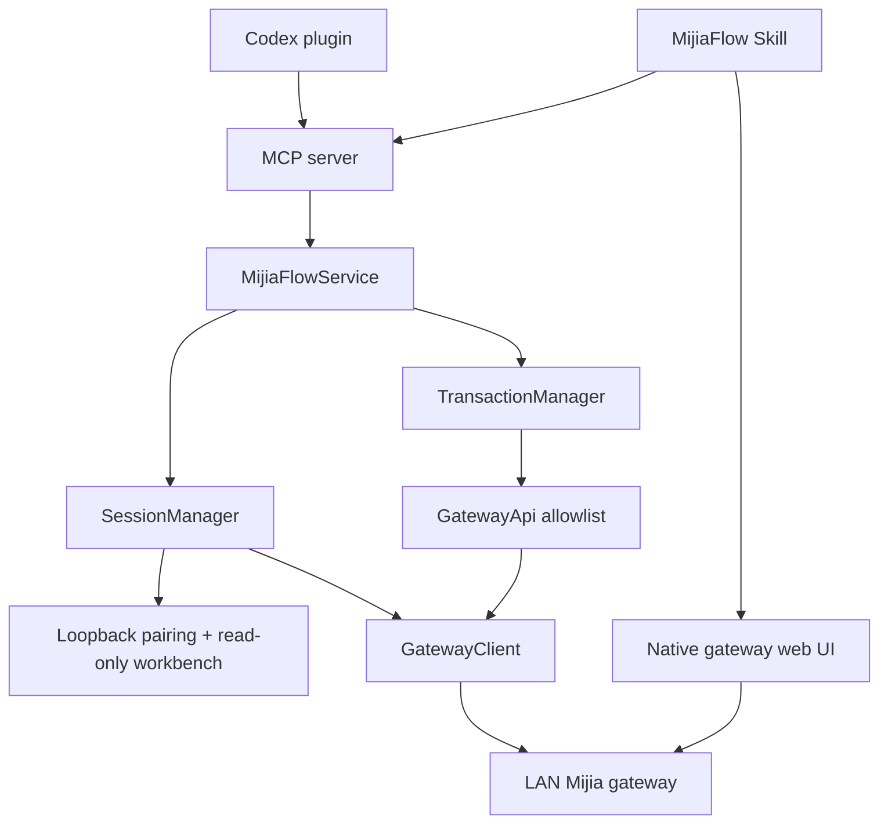

# MijiaFlow Project Context

## Purpose

MijiaFlow is an unofficial, LAN-first Codex plugin and local MCP server for auditing and controlling Mijia Central Hub Geek Edition automations. It separates browser-based graph editing from an allowlisted local API path with explicit backups, confirmations, verification, and rollback.

## Architecture

- `.codex-plugin/plugin.json` and `.mcp.json`: Codex plugin metadata and MCP server launch configuration.
- `mcp/src/server.ts`: MCP tool schemas, annotations, result serialization, and process lifecycle.
- `mcp/src/service.ts`: serialized orchestration across sessions and transactions.
- `mcp/src/session/`: token-bound loopback pairing/workbench page and authenticated session ownership.
- `mcp/src/protocol/`: WebSocket framing, ECJPAKE authentication, AES-GCM channels, compression, and JSON-RPC transport.
- `mcp/src/domain/`: compatibility probing, allowlisted gateway operations, backups, plans, guarded apply, and rollback.
- `skills/mijiaflow/`: Codex workflow instructions for browser and MCP control paths.
- `mcp/dist/server.js`: committed runnable bundle generated from `mcp/src/server.ts` and its dependency graph.

## Important Entry Points

- MCP process: `mcp/src/server.ts`
- Public service API: `mcp/src/service.ts`
- Gateway transport and error boundary: `mcp/src/protocol/gateway-client.ts`
- Transaction workflow: `mcp/src/domain/transaction-manager.ts`
- Public contracts: `README.md`, `README.zh-CN.md`, and `docs/api-reference.md`

## Workflows and Constraints

- The gateway passcode is accepted only by the one-time `127.0.0.1` pairing form and is never a tool argument. After submission, that token-bound page remains a read-only workbench with a same-origin state endpoint; MCP remains the only write path.
- `mijia_session_status` reports pairing/session progress from in-memory state only; it never touches the gateway or re-exposes the pairing URL.
- Only private, loopback, or link-local gateway targets are accepted; DNS resolution is pinned and revalidated.
- The supported write pair is frontend `v1.6.1` with protocol `2.0.0`; other combinations are read-only.
- Non-backup writes require a plan, a verified post-plan backup receipt, exact confirmation, baseline recheck, readback verification, and retained rollback state.
- Gateway-originated error text is untrusted and must not be copied into MCP results; expose stable local messages and narrowly typed metadata only.
- Keep `mcp/dist/server.js` synchronized with source changes because `.mcp.json` launches the bundle directly.
- Keep raw gateway captures, logs, pairing URLs, device identifiers, and real values under ignored local evidence paths such as `work/`.

## Development Commands

- Install: `npm ci`
- Type check: `npm run typecheck`
- Tests: `npm test`
- Build committed bundle: `npm run build`
- Full verification: `npm run verify`

Run validation commands only when the current user request explicitly authorizes their scope.

## Current Risks

- Gateway protocol compatibility is intentionally narrow and should not be expanded without current device evidence.
- Cloud backup records are eventually consistent; a completed gateway operation may not appear during the current 30-second list window.
- The committed bundle can drift from source when either side is edited manually; protocol-boundary fixes must update both paths together.
