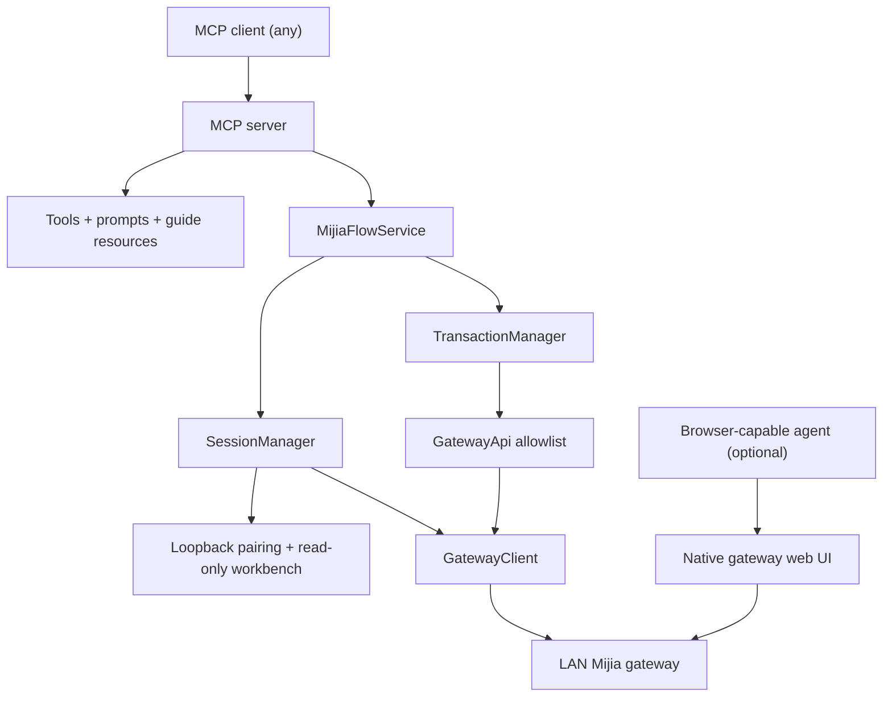

# MijiaFlow Project Context

## Purpose

MijiaFlow is an unofficial, LAN-first MCP server for auditing and controlling Mijia Central Hub Geek Edition automations from any MCP client. It is distributed as the npm package `mijiaflow` (bin `mijiaflow`, launched with `npx -y mijiaflow`) and separates optional browser-based graph editing from an allowlisted local API path with explicit backups, confirmations, verification, and rollback.

## Architecture

- `package.json`: npm publishing surface (`bin`, `files`, `prepublishOnly`) plus the development scripts.
- `.mcp.json`: repo-local MCP launch configuration for development checkouts.
- `mcp/src/server.ts`: CLI flags, MCP tool/prompt/resource registration, output schemas, error hints, and process lifecycle.
- `mcp/src/guide.ts`: server instructions and the guide resources; imports `docs/*.md` as text so they are embedded in the bundle.
- `mcp/src/service.ts`: serialized orchestration across sessions and transactions, plus workbench snapshot redaction.
- `mcp/src/session/`: token-bound loopback pairing/workbench page and authenticated session ownership.
- `mcp/src/protocol/`: WebSocket framing, ECJPAKE authentication, AES-GCM channels, compression, and JSON-RPC transport.
- `mcp/src/domain/`: compatibility probing, allowlisted gateway operations, backups, plans, guarded apply, and rollback.
- `docs/`: public contracts and the agent-facing guides that are also served as MCP resources.
- `mcp/dist/server.js`: committed runnable bundle generated from `mcp/src/server.ts` and its dependency graph.

## Important Entry Points

- MCP process and public surface: `mcp/src/server.ts`
- Agent-facing guidance: `mcp/src/guide.ts`
- Public service API: `mcp/src/service.ts`
- Gateway transport and error boundary: `mcp/src/protocol/gateway-client.ts`
- Transaction workflow: `mcp/src/domain/transaction-manager.ts`
- Public contracts: `README.md`, `README.zh-CN.md`, `CHANGELOG.md`, and `docs/api-reference.md`

## Workflows and Constraints

- The gateway passcode is accepted only by the one-time `127.0.0.1` pairing form and is never a tool argument. After submission, that token-bound page remains a read-only workbench with a same-origin state endpoint; MCP remains the only write path.
- `mijia_session_status` reports pairing/session progress from in-memory state only; it never touches the gateway or re-exposes the pairing URL.
- Only private, loopback, or link-local gateway targets are accepted; DNS resolution is pinned and revalidated.
- The supported write pair is frontend `v1.6.1` with protocol `2.0.0`; other combinations are read-only.
- Non-backup writes require a plan, a verified post-plan backup receipt, exact confirmation, baseline recheck, readback verification, and retained rollback state.
- Gateway-originated error text is untrusted and must not be copied into MCP results; expose stable local messages, locally generated hints, and narrowly typed metadata only.
- Stay client-neutral: no Codex-, Cursor-, or vendor-specific plugin layer, and no client name in page text, tool descriptions, or docs.
- Guide resources are `docs/*.md` imported through the esbuild `text` loader; the build also injects `__MIJIAFLOW_VERSION__` from `package.json`. Editing a guide changes the shipped bundle.
- Keep `mcp/dist/server.js` synchronized with source changes because both `.mcp.json` and the published `bin` launch the bundle directly.
- Keep raw gateway captures, logs, pairing URLs, device identifiers, and real values under ignored local evidence paths such as `work/`.

## Development Commands

- Install: `npm ci`
- Type check: `npm run typecheck`
- Tests: `npm test` (includes a stdio smoke test that boots `mcp/dist/server.js`)
- Build committed bundle: `npm run build`
- Full verification: `npm run verify` (typecheck, then build, then test)
- Packaging check: `npm pack --dry-run`

Run validation commands only when the current user request explicitly authorizes their scope.

## Current Risks

- Gateway protocol compatibility is intentionally narrow and should not be expanded without current device evidence.
- Cloud backup records are eventually consistent; a completed gateway operation may not appear during the current 30-second list window.
- The committed bundle can drift from source when either side is edited manually; protocol-boundary fixes must update both paths together, and CI fails on an out-of-date bundle.
- The end-to-end path against a real gateway is not covered by automated tests; protocol changes need device verification recorded in `docs/compatibility.md`.
